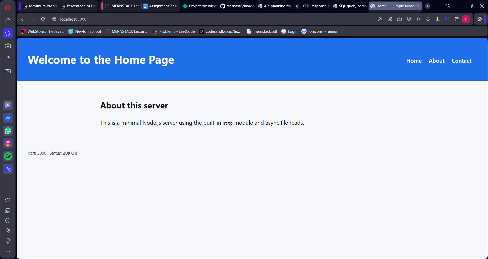

Description of Assignment 6:-

Here i need to create simple server with home, contact, about page and 404 error page:

Now,
start node.js=> npm init
it will create server with server.js as start file and default remaining files. 

Also, include nodemon servier.js as dev so that it will automanticaly restart the server if any changes happen in code. 

Now, in this server.js file i have imported http to create server and fs to read files from my system. 
I set port number '3000' to listen the server

For handling request, 
client sends request and then server checks the reqest url which will be path of the page
Here, 
	home=>"/"
	about=>"/about"
	contact=>"/contact"
	other that above pages=> 404 page
for each of this path i store there .html file in public folder and access those file by using fs.readFile()
each files path is been send by using this fs. Here, __dirname tells that file is present in the same file as server.js and then path of that file like "/public/home.html"
Now, if file is found at that path then that .html page will get opened with 200 port saying success and with contents COntent-type:text/html and if file not found then it will send internal server erro with 500 port.

Borwser response will be if url is http://localhost:3000/ or /about or /contact then it will open respective .html pages and if there is another url other that above then will show default error page which is 404 error page.

Server is running and listening using server.listen() which start the server and we can open http://localhost:300 in our browser to test it. 

